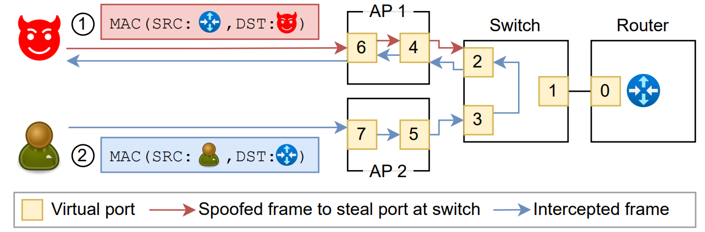

# <div align="center">AirSnitch: Testing Wi-Fi Client Isolation</div>


This repository contains AirSnitch, a tool to test the security of client isolation in home and enterprise Wi-Fi networks. Sometimes also called AP (Access Point) isolation, client isolation is not a standardized feature of Wi-Fi. Instead, vendors added client isolation as an ad-hoc defense to prevent clients from attacking each other. For instance, client isolation normally prevents traditional ARP-based MitM attacks. However, our [NDSS'26 paper](https://papers.mathyvanhoef.com/ndss2026-airsnitch.pdf) shows that client isolation is often implemented in inconsistent and insecure ways. With AirSnitch, you can test if client isolation is implemented and configured as expected in your Wi-Fi network.

<sub>Note: AirSnitch as used in our NDSS'26 paper can be found on [GitHub](https://github.com/zhouxinan/airsnitch) and [Zenodo](https://doi.org/10.5281/zenodo.17905485). This version contains various updates.</sub>

<a id="id-toc"></a>
## [Table of Contents](#id-toc)

* [1. Introduction](#id-intro)
* [2. Prerequisites](#id-prereq)
* [3. Before every usage](#id-everyuse)
* [4. Main Vulnerability Tests](#id-mainflaws)
* [5. Extra Vulnerability Tests](#id-extraflaws)
* [6. Defenses and mitigations](#id-defenses)
* [7. Troubleshooting](#id-troubleshooting)


<a id="id-intro"></a>
## [1. Introduction](#id-intro)

AirSnitch can test for three main attack categories to bypass client isolation. These attacks bypass Wi-Fi encryption, meaning that simply using WPA1/2/3 does not, on its own, prevent these attacks. Our [NDSS'26 AirSnitch](https://papers.mathyvanhoef.com/ndss2026-airsnitch.pdf) paper covers these attack in detail, a high-level overview is:

1. **Abusing GTK group keys**: An adversary can abuse the group key(s) that are shared between all clients in the same Wi-Fi network. In particular, the GTK group key can be used to inject packets directly to one or more victims. Additionally, all operating systems we tested accept unicast IP packets inside broadcast Wi-Fi packets. This means an adversary can inject arbitrary packets by injecting the following Wi-Fi frame (in [Scapy](https://scapy.readthedocs.io/en/latest/api/scapy.layers.dot11.html) notation):

	```
	Dot11(dst=ff:ff:ff:ff:ff:ff, src=access point) / IP(dst=victim, src=adversary)
	```

	This packet is then encrypted using the shared group key which is known by all clients, including by malicious insiders. Only the client with the specified destination IP address will then process the injected packet, meaning targeted attacks remain possible. This is similar the [WPA Too: Hole 196](https://defcon.org/html/links/dc-archives/dc-18-archive.html#Ahmad) attack, but now in the context of bypassing client isolation, which was not previously studied.


2. **Gateway Bouncing**: Many networks only enforce client isolation at the MAC/Ethernet layer. This allows an adversary to bypass client isolation by tricking the gateway into forwarding packets to the victim at the IP layer, i.e., by ‘bouncing’ packets at the gateway. Concretely, an adversary can send the following type of packet:

	```
	Ethernet(src=attacker, dst=gateway) / IP(src=attacker, dst=victim)
	```

	This packet does not get blocked by client isolation, because at the MAC/Ethernet layer, the packet is destined to the gateway and not another client. However, the gateway will then route the packet at the IP layer.


3. **Port Stealing** (across BSSIDs): An adversary can manipulate internal switches and bridges to forward the victim’s uplink *and* downlink traffic to the adversary. The idea to intercept *uplink* traffic is illustrated in the following figure:

	<div align="center"></div>

	Here the victim is connected to the access point AP2, and the adversary then connects to a different access point AP1 while spoofing the MAC address of the internal gateway (step 1). As a result, when the victim now tries to send uplink traffic to the real gateway, the traffic is instead routed to the attacker (step 2). The red line represent spoofed traffic to manipulate routing tables, and the blue line represented the intercepted uplink traffic.
	
	To intercept *downlink* traffic, a similar attack is possible, where the adversary spoofs the victim’s MAC address, causing the network to route the victim’s uplink frames to the adversary (see [this figure](steal-downlink.png)).


<a id="id-impact"></a>
### [1.1 Practical Impact](#id-impact)

All combined, the above techniques enable an adversary to **restore MitM capabilities even in the face of client isolation**. In our [NDSS'26 paper](https://papers.mathyvanhoef.com/ndss2026-airsnitch.pdf), we found that most home routers are vulnerable, find lacking security guarantees in enterprise devices, and confirm vulnerabilities in real-world enterprise networks. Important highlights are:

- Against home routers that enable the creation of a guest network, in addition to the main network, our attacks allow breakig the isolation between the guest and main network. That is, a device within the guest network can attack devices in the main network.

- Even when only able to inject packets to a victim impactful attacks are possible. For instance, injecting malicious ICMPv6 Router Advertisements can trick a client into using a malicious DNS server, enabling subsequent interception of all IP-based traffic. See [FragAttacks](https://papers.mathyvanhoef.com/fragattacks-overview.pdf) for details.

- Our techniques can also inject or intercept traffic from/to _internal_ devices. In particular, it may be possible to intercept the RADIUS packets generated by an Access Point. This can enable RADIUS credential theft and the subsequent creation of rogue Enterprise networks.

- Our attacks can be effectively accross different networks, APs, and BSSIDs. For instance, against one university network, we could use port stealing to leak a victim's traffic from a WPA2/3 network into an open network, allowing anyone within radio range to see the leaked traffic.

- Note that to obtain a full MitM without disrupting traffic, some extra techniques are needed that are further covered in our paper, e.g., _Server-Triggered Port Restoration_ or _Inter-NIC Relaying_.


<a id="id-compare-macstealer"></a>
### [1.2 Comparison to MacStealer](#id-compare-macstealer)

Our [USENIX Security '23 framing frames](https://www.usenix.org/conference/usenixsecurity23/presentation/schepers) paper, and its [MacStealer tool](https://github.com/vanhoefm/macstealer), also contains a client isolation bypass. AirSnitch extends this work. Summarized, MacStealer corresponds the `--c2c-port-steal` test of AirSnitch in the specific case where the victim and adversary connect to the _same BSSID_. **All other tests below of AirSnitch are novel** and aren't covered in the framing frames paper. Put differently, the original MacStealer tool only covers port stealing against a single BSSID and only to intercept downlink traffic.

Patching the original 'MacStealer' bypass is also [non-trivial](https://github.com/vanhoefm/macstealer/blob/main/README.md#id-mitigations), where an ideal fix may even require that both access points _and_ clients implement the ["Reassociating STA recognition" extension](https://mentor.ieee.org/802.11/dcn/23/11-23-0537-07-000m-reassociating-sta-recognition.docx) to the (draft) IEEE 802.11 standard. As a result, the 'MacStealer' flaw was left as an open problem by most vendors. In contrast, most new issues covered by AirSnitch are considered implementation and configuration flaws, and are therefore easier to fix in practice.


<a id="id-prereq"></a>
## [2. Prerequisites](#id-prereq)

Our scripts were tested on **Ubuntu 22.04.5 LTS**. We therefore recommend to use [Ubuntu 22.04](https://releases.ubuntu.com/jammy/). You can do this in [VirtualBox](https://www.virtualbox.org/wiki/Downloads) if you have USB Wi-Fi dongles.

The following steps only need to be executed once to initialize the repository and to compile the necessary executables on your machine. First, install the necessary dependencies:

	sudo apt update
	sudo apt install libnl-3-dev libnl-genl-3-dev libnl-route-3-dev \
		libssl-dev libdbus-1-dev pkg-config build-essential net-tools python3-venv \
		aircrack-ng rfkill git dnsmasq tcpreplay macchanger

Next, clone this repository, and run the following script in the root directory of the repository to compile our modified hostap release:

	./setup.sh
	cd airsnitch/research
	./build.sh
	./pysetup.sh


<a id="id-everyuse"></a>
## [3. Before every usage](#id-everyuse)

<a id="id-everyuse-env"></a>
### [3.1. Execution environment](#id-everyuse-env)

Before every use, you must load the Python environment as root:

	cd airsnitch/research
	sudo su
	source venv/bin/activate

You should now [disable Wi-Fi in your network manager](https://github.com/vanhoefm/libwifi/blob/master/docs/linux_tutorial.md#id-disable-wifi) so it will not interfere with AirSnitch. Optionally, check using `sudo airmon-ng check` to see which other processes might be using the wireless network card and might interfere with AirSnitch.

<a id="id-everyuse-net"></a>
### [3.2. Network configuration](#id-everyuse-net)

The next step is to edit [`client.conf`](research/client.conf) with the information of the network that you want to test. This is a configuration file for [`wpa_supplicant`](https://wiki.archlinux.org/title/wpa_supplicant#Connecting_with_wpa_passphrase) that must contain two network blocks: one representing the victim and one representing the attacker. An example configuration file to test isolation between the WPA2/3 networks `main-network` and `guest-network` is:

	# Don't change this line, otherwise AirSnitch won't work
	ctrl_interface=wpaspy_ctrl

	network={
		# Don't change this field, the script relies on it
		id_str="victim"

		# Network to test: network/SSID that the simulated victim is in
		ssid="main-network"
		key_mgmt=WPA-PSK
		psk="main-password"
	}

	network={
		# Don't change this field, the script relies on it
		id_str="attacker"

		# Network to test: network/SSID that the simulated adversary is in
		ssid="guest-network"
		key_mgmt=WPA-PSK
		psk="guest-password"
	}

In the part "network to test" you must provide the name of the network being tested, its security configuration, and any applicable credentials. See [wpa_supplicant.conf](wpa_supplicant/wpa_supplicant.conf) for documentation on to write/edit configuration files and for example network blocks for various types of Wi-Fi networks. In the first network block, containing `id_str="victim"`, you must specify the network that the victim belongs to. In the second network block, you specify the network info of the simulated attacker.

In the above example, AirSnitch will test an attack where an adversary in the guest network will try to attack a victim in the main network.

By default the script uses the configuration file `client.conf`. You can use a different configuration file by providing the `--config network.conf` paramater, where you can replace `network.conf` with the configuration file that you want to use. This repository contains the following example configuration files:

- [`eap.conf`](airsnitch/research/eap.conf): A configuration file to test an Enterprise network that uses PEAP-MSCHAPv2 for authentication, with unique usernames and passwords for the victim and attacker.

- [`multipsk.conf`](airsnitch/research/multipsk.conf): A configuration file to test a network that uses multi-PSK where one password is used by trusted devices and a second password is given to guests.

- [`saepk.conf`](airsnitch/research/saepk.conf): A configuration file to test a public hotspot that uses SAE-PK.


<a id="id-everyuse-bssid"></a>
### [3.3. BSSID selection](#id-everyuse-bssid)

AirSnitch requires certain parameters to ensure the correct networks and APs are being tested:

- `--same-bss` or `--other-bss`: you must include at least one of these parameters to specify whether the victim and adversary must connect to the same AP/BSSID (`--same-bss`) or a different AP/BSSID (`--other-bss`). Alternatively, you can [explicitly specify a BSSID](#id-test-bss) for both the victim and adversary in the network configuration.

- `--no-ssid-check`: include this parameter if the simulated victim and attacker are connecting to different SSIDs. Otherwise, when the [network configuration](#id-everyuse-net) specifies different SSIDs for the victim and attacker, AirSnitch will quit with an error message.


<a id="id-mainflaws"></a>
## [4. Main Vulnerability Tests](#id-mainflaws)

<a id="id-mainflaws-gtk"></a>
### [4.1. GTK Abuse](#id-mainflaws-gtk)

Execute the following command to determine whether the simulated adversary and victim are given the same GTK group key by the network:

	./airsnitch.py wlan2 --check-gtk-shared wlan3 --no-ssid-check [--other-bss,--same-bss]

AirSnitch will connect using both network cards to the network and will save the GTK group key that is given by the network. Recall that the parameter `--other-bss` is used to make the victim and adversary connect to different APs/BSSIDs, while the `--same-bss` parameter is used to connect to the same AP/BSSID. This enables you to test whether group keys are shared between different APs/BSSIDs (`--other-bss`) and/or whether they are shared between clients on the same AP/BSSID (`--same-bss`).

The script will output the following:

	>>> The victim's GTK is (XXX)."
	>>> The attacker's GTK is (YYY)."

If the keys XXX and YYY are identitical, then the network is vulnerable, meaning adversary can attack the victim by abusing the shared group key.


<a id="id-mainflaws-bounce"></a>
### [4.2. Gateway Bouncing](#id-mainflaws-bounce)

Execute the following command to test for isolation at the IP layer between the simulated adversary and victim:

	./airsnitch.py wlan2 --c2c-ip wlan3 --no-ssid-check [--other-bss,--same-bss]

AirSnitch will connect using both network cards, and then send a specially-crafted IP-layer packet between the adversary and victim as explained in the [Introduction](#id-intro). The attack is successful, meaning the network is vulnerable, if the following output in red is shown:

	>>> Client to client traffic at IP layer is allowed (PSK{pw_atkr} to SAE{pw_victim})

The text between parenthesis will differ based on the networks being tested and the network credentials used.

<a id="id-mainflaws-port-down"></a>
### [4.3. Downlink Port Stealing](#id-mainflaws-port-down)

Execute the following command to simulate a port stealing attack between the adversary and victim, where the adversary tries to intercept traffic towards the victim:

	./airsnitch.py wlan2 --c2c-port-steal wlan3 --no-ssid-check --other-bss --server 8.8.8.8

Here the `--server` parameter must be an IP address that replies to ping requests. The script will connect using both network cards to the network. Then, the script will:

1. Send a stream of ping requests as the victim to the server. The server will send ping replies back to the victim. These ping replies is the traffic the adversary will try to intercept.

2. The adversary will spoof the MAC address of the victim, will also connect to the network, and then injects (bogus) IPv4 packets while spoofing the MAC address of the victim. In a successfull attack, this will cause the network to forward the ping replies to the adversary.

The attack is successful if the following output in red is shown:

	>>> Downlink port stealing is successful.

Note that in this attack, the `--same-bss` parameter typically doesn't make sense to use. This is because when using this parameter under this attack, both the adversary and victim have the same MAC address, and would try to connect to the same BSSID. That mean they would interfere with each other and essentially (constantly) kick each other off the network. This is why only using the `--other-bss` argument makes sense.


<a id="id-mainflaws-port-up"></a>
### [4.4. Uplink port stealing](#id-mainflaws-port-up)

Execute the following command to simulate a port stealing attack between the adversary and victim, where the adversary tries to intercept traffic sent by the victim:

	./airsnitch.py wlan2 --c2c-port-steal-uplink wlan3 --no-ssid-check [--other-bss,--same-bss] [--server 1.2.3.4]

Here exactly which `--server` IP address is used is not important. The script will connect using both network cards to the network. Then, the script will:

1. Send a stream of ping requests as the victim to the server (the server doesn't have to reply). The adversary will try to intercept these ping requests.

2. The adversary will spoof the MAC address of the network's gateway, will also connect to the network, and then injects (bogus) IPv4 packets while spoofing the MAC address of the network's gateway. In a successfull attack, this will cause the network to forward the ping requests to the adversary.

The attack is successful if the following output in red is shown:

	>>> Uplink port stealing is successful.

Unlike downlink port stealing, with uplink port stealing both the parameters `--other-bss` and `--same-bss` make sense to use. We encountered networks where connecting to a different BSSID of the same AP resulted in a failed attack, while connecting to the same BSSID resulted in a successfull attack (vice versa might also be possible).


<a id="id-extraflaws"></a>
## [5. Extra Vulnerability Tests](#id-extraflaws)

<a id="id-bcast-reflect"></a>
### [5.1. Broadcast Reflection](#id-bcast-reflect)

This test is closely related to GTK Abuse (`--check-gtk-shared`) and can be executed as follows:

	./airsnitch.py wlan2 --c2c-broadcast --no-ssid-check [--other-bss,--same-bss]

AirSnitch will connect using both network cards to the network. The adversary will then send a broadcast Wi-Fi frame containing a unicast IP address, routed through the AP. In other words, the adversary will send the (possibly encrypted) frame of the following format:

	Dot11(FCfield="to-DS", addr1=adversary, addr2=AP, addr3=ff:ff:ff:ff:ff:ff)
		/ IP(dst=victim, src=adversary)

If the AP forwards this frame, despite client isolation being enabled, then the network is vulnerable and AirSnitch will show the following:

	>>> Broadcast Reflection is allowed (PSK{pw_atkr} to SAE{pw_victim})

The text between parenthesis will differ based on the networks being tested and the network credentials used.


<a id="id-test-bss"></a>
### [5.2. Testing a specific Access Point / BSS](#id-test-bss)

By default, AirSnitch will automatically select an AP/BSS of the network to connect with and test. In case you have a network with multiple APs/BSSes, you can test a specific one by specifying this AP/BSS in the network block of the victim using the `bssid` keyword. For example, you can use:

	...

	network={
		# Don't change this field, the script relies on it
		id_str="victim"

		# Network to test: network/SSID that the simulated victim is in
		ssid="main-network"
		key_mgmt=WPA-PSK
		psk="main-password"

		# This a specific AP/BSS
		bssid=00:11:22:33:44:55
	}

	...

With the above configuration, AirSnitch will connect to `00:11:22:33:44:55` as the simulated victim. The simulated adversary can connect to any AP/BSS, unless the `bssid` keyword is also used in the network block of the attacker, or the `--same-bss` argument is used.

- When the above example is combined with the `--other-bss` parameter, the victim will still connect to `00:11:22:33:44:55`, but the attacker will then always connect to a _different_ BSSID.

- Another option is to specify an explicit BSS/AP in the network block of the victim _and_ attacker.


<a id="id-manual"></a>
### [5.3. Manual tests](#id-manual)

Some aspects are not directly covered by this scripts and require manual testing, or might be implemented in future versions. These are:

- Testing whether the IGTK group key is randomized under client isolation.


<a id="id-defenses"></a>
## [6. Defenses and mitigations](#id-defenses)

Because client isolation is not standardized and its security expectations may differ between users, there is no one-size-fits-all solution. Depending on the products being used, a combination of software updates and/or configuration updates are needed to prevent our attacks. Overall, **more work is still needed to define and standardize a strong definition of client isolation**, and to rigurously ensure its enforcement in practice.

**In the meantime, we recommend the following mitigations**: (1) documenting the product's existing security guarantees of client isolation; (2) group key randomization; (3) filtering unicast IP pakcets in broadcast Wi-Fi frames; (4) usage of VLANs and firewall rules; (5) MAC address spoofing prevention; (6) IP address spoofing prevention; (7) using centralized Wi-Fi decryption and routing; and (8) providing warnings on insecure configurations. While each of these recommendations on their own may not always fully prevent all attacks, their combination would drastically improve the security of client isolation.

Depending on the product, the below mitigations can either be enabled by default, or should at least be configurable.


<a id="id-defenses-docs"></a>
## [6.1. Proper documentation](#id-defenses-docs)

For products that provide a central client isolation setting, such as home routers that provide a guest network in addition to the main network, the product should properly document exactly what the security guarentees of the guest network and/or client isolation are:

1. Are clients in the guest network allowed to communicate with each other?

2. Is traffic allowed between the guest and main network? In which direction?

3. Are wired devices also isolated from each other and/or from Wi-Fi clients?

4. _Optionally:_ Is there also isolation between devices of the same user, i.e., is there is isolation between clients that use the same EAP identity, or between clients that use the same passphrase when using [per device/user passphrases (PPSK)](https://www.supernetworks.org/pages/docs/knowledgebase/ppsk-wpa3-wifi-security) or similar?


<a id="id-defense-randgtk"></a>
## [6.2. Group key randomization](#id-defense-randgtk)

Clients that are isolated from each other should be given different group keys. One way to ensure this is to **add a configuration option**, or to by default, give every client a randomized group key, which is a defense that is in line with the [recommendations in the Passpoint specification](https://www.wi-fi.org/file/passpoint-specification-package). That is, the access point should give each client a different randomized group key during the 4-way handshake, the group key handshake, the Fast Initial Link Setup (FILS) handshake, the Fast BSS Transition (FT) handshake, in WNM-Sleep Response frames, and in any future handshake that may get added to the IEEE 802.11 standard.

To still handle essential broadcast traffic, such as broadcast ARP and DHCP traffic, the network can implement layer-2 multicast/broadcast to unicast conversion. Specifically, a _Proxy ARP service_ and _conversion of ICMPv6 Router Adverisement packets_ can be implemented. Further details and techniques for this can be found in the [Passpoint specification](https://www.wi-fi.org/file/passpoint-specification-package).

Note that some devices have a separate option to ensure that group keys are different in each VLAN, e.g., see Cambium's `gtk-per-vlan` option. Put differently, if your network equipment doesn't yet support randomized group keys, you can at least try to ensure that each VLAN uses a unique group key.


<a id="id-defense-filter-bcast"></a>
## [6.3. Filtering unicast IP pakcets in broadcast Wi-Fi frames](#id-defense-filter-bcast)

Client operating systems should by default drop unicast IP packets in layer 2 broadcast/multicast frames, or at least have an option to control this behaviour. As an example, Linux has the sysctl `drop_unicast_in_l2_multicast=1` to enable this dropping behaviour.


<a id="id-defenses-vlan"></a>
## [6.4. Usage of VLANs and firewall rules](#id-defenses-vlan)

An ad-hoc defense is the usage of VLANs. This can be used to isolate the guest from the main network. Additionally, using unique VLANs per client, as for instance is [done by SRP](https://www.supernetworks.org/pages/blog/guest-ssid-on-spr), can also help enforce client isolation within a network.

But even when using VLANs, you must ensure that [randomized group keys](#id-defense-randgtk) are used or at least that different group keys are used per VLAN, both for GTK and IGTK groups keys, and you must ensure that proper firewall rules are in place between the VLANs.

When configuring firewall rules, be sure to remember the following two aspects:

- Ensure client isolation is ensured at botht the MAC/Ethernet layer _and_ at the IP layer.

- Ensure broadcast traffic at the MAC/Ethernet layer is also isolated under client isolation.


<a id="id-defenses-mac-spoof"></a>
## [6.5. MAC spoofing preventation](#id-defenses-mac-spoof)

Product should have an option to prevent clients from using a MAC address that is already in use by an internal wired device, e.g., to ensure clients are prevented from using the same MAC address as the gateway, DNS server, DHCP server, or other essential internal devices.

Additionally, the network can prevent a MAC address from being actively associated and authenticated to multiple BSSIDs, which would prevent the cross-BSSID downlink port-stealing attack.

Lastly, to also prevent single-BSSID downlink port-stealing attacks, the [recommendations of MacStealer](https://github.com/vanhoefm/macstealer#id-mitigations) should be followed.

Optionally, functionality can be added to configure an allowlist of MAC addresses that can be reached by all clients. This would allow users to enable clients to still access internal printers or file servers, by allowlisting thier MAC addresses, despite client isolation being enabled (with the idea that these devices are also unlikely to use MAC address randomization).


<a id="id-defenses-ip-spoof"></a>
## [6.6. IP spoofing preventation](#id-defenses-ip-spoof)

As an additional mitigation, we also recommend the adoption of IP spoofing prevention. Doing so makes it harder to abuse our bypasses to establish a full bi-directional MitM. In particular, it prevents the adversary from forwarding intercepted uplink/downlink traffic back into the network using _Gateway Bouncing_ or similar techniques.


<a id="id-defense-central"></a>
## [6.7. Using centralized Wi-Fi decryption and routing](#id-defense-central)

Enterprise equipment may provide an option to let a central controller decrypt and route all Wi-Fi traffic. In our experiments, we found that this can make attacks harder. Therefore, in case the above mitigations are not available in your setup, or they do not prevent all bypasses, consider enabling this option to let the controller decrypt all Wi-Fi traffic.


<a id="id-defenses-config"></a>
## [6.8. Warnings](#id-defenses-warnings)

Lastly, we recommend that vendors implement the following warnings or mitigations to further improve security:

- When enabling client isolation in an open network, or a network with a shared WPA password, give a warning that this provides no security benifit.

- When providing guest network functionality, have an option/warning to also enable isolation between guest clients, i.e., to have client isolation within the guest network itself.


<a id="id-troubleshooting"></a>
# [7. Troubleshooting](#id-troubleshooting)

- If AirSnitch fails to connect to a particular network, first try to use your client.conf file with your system's built-in `wpa_supplicant`. If you also can't connect in that manner, then the problem might be your client.conf file, your Wi-Fi network card, the network itself, etc. Note that AirSnitch will search for at most 30 seconds for the given AP/BSS. If it cannot find the specified AP/BSS the tool will quit.

- When using Ubuntu 22.04 on VirtualBox 7 or higher, we noticed that the terminal may not properly start after installation. To fix this, follow [these steps](https://askubuntu.com/questions/1435918/terminal-not-opening-on-ubuntu-22-04-on-virtual-box-7-0-0). Alternatively, when installing Ubuntu 22.04, check/enable the option "Skip Unattended Installation".

- The test `--c2c-gtk-inject` relies on the Linux machine having set the sysctl `drop_unicast_in_l2_multicast` to `0`, since the simulated victim is a Linux client itself and the script monitors the managed interface for the injected frame.

